# Suitcase Lock Recovery Tool

A web-based interactive simulation that helps travelers recover forgotten combinations for 3-digit suitcase locks.

## [🔗 Live Demo](https://voyagevault.vercel.app/)

## Purpose

Ever been stuck with a locked suitcase and can't remember the combination? This tool demonstrates a non-destructive technique to recover forgotten combinations by exploiting the mechanical design of most 3-digit suitcase locks.

## How It Works

Most suitcase combination locks have wheels with internal "gates" or holes that need to align for the lock to open. This tool guides you through the recovery process:

```mermaid
flowchart TD
    A[Start: Locked suitcase with forgotten combination] --> B[Look at back/underside of lock]
    B --> C[Rotate each dial until all 3 holes align]
    C --> D[Note the numbers showing on the front]
    D --> E[Try unlocking with these numbers]
    E -->|Success| F[Suitcase unlocked! 🎉]
    E -->|Fails| G[Increment all 3 numbers by 1]
    G --> H[Try unlocking again]
    H -->|Success| F
    H -->|Fails| I[Continue incrementing and trying]
    I --> J[After 10 attempts max, one combination will work]
    J --> F
    
    style F fill:#4caf50,stroke:#388e3c,color:white
    style A fill:#f44336,stroke:#d32f2f,color:white
```

Instead of trying all 1000 possibilities, you'll only need to try about 10 combinations!

## Features

- 🔄 Interactive 3D lock simulation with rotating dials
- 👁️ Visual feedback for hole alignment
- 🔢 Step-by-step guided recovery process
- 📊 Progress tracking for combinations tried
- 🧮 Combination generator for your real lock
- 🌓 Light/Dark mode toggle
- 📱 Responsive design for all devices

## Ethical Use Statement

This tool is intended only for recovering access to your own luggage when you've forgotten the combination. Using this method on someone else's property without permission is illegal and unethical.
